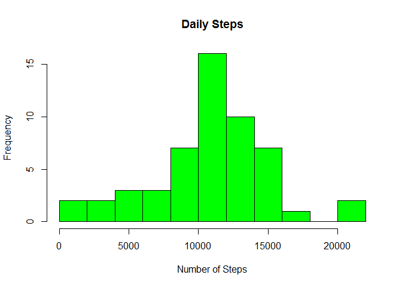
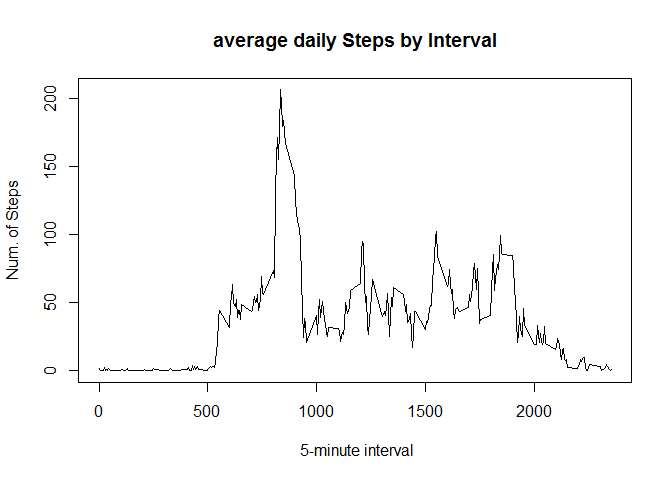
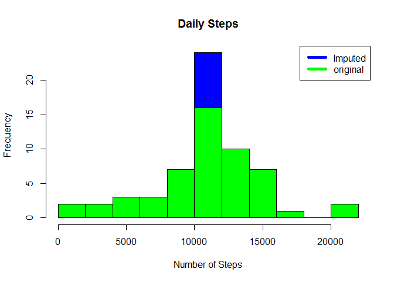
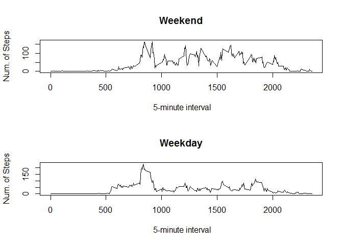

# reproducible-research--course-project-1
I Sh  
May 13, 2017  


## Loading loading data into data frame


```r
if(!file.exists("getdata-projectfiles-UCI HAR Dataset.zip")) {
        download.file("http://d396qusza40orc.cloudfront.net/repdata%2Fdata%2Factivity.zip",destfile = "dataa.zip")
        unzip("dataa.zip")
}

data <- read.csv("activity.csv")
head(data)
```

```
##   steps       date interval
## 1    NA 2012-10-01        0
## 2    NA 2012-10-01        5
## 3    NA 2012-10-01       10
## 4    NA 2012-10-01       15
## 5    NA 2012-10-01       20
## 6    NA 2012-10-01       25
```


## What is mean total number of steps taken per day?
###Sum daily steps, Histogram.

```r
dailystep <- by(data$steps, data$date, sum)
hist(dailystep, main = paste("Daily Steps"), col="green", xlab="Number of Steps", breaks = 15)
```

<!-- -->
###calculate mean and median

```r
rmean <- mean(dailystep,na.rm = T)
rmedian <- median(dailystep,na.rm = T)
```
The ``mean`` is 1.0766189\times 10^{4} and the ``median`` is 10765.

## What is the average daily activity pattern?

###Calculate average steps for each interval for all days. 
 

```r
avstepsdaily <- aggregate(steps ~ interval, data, mean)
```
###Plot the Average Number Steps per Day by Interval.

```r
plot(avstepsdaily$interval,avstepsdaily$steps, type="l", xlab=" 5-minute interval", ylab="Num. of Steps",main="average daily Steps by Interval")
```

<!-- -->
###Find interval with most average steps. 

```r
max <- avstepsdaily[which.max(avstepsdaily$steps),]
```

 the interval contains  maximum number of steps is `835`.

## Impute missing values.
### Calculate total number of missing values in the dataset:

```r
nas<-is.na(data$steps)
nasum<-sum(nas)
```
total number of missing values is `2304`

###Compare imputed to original data. Missing values were imputed by inserting the average for each interval.  

```r
data2<-data
data2$steps[nas] <- avstepsdaily[avstepsdaily==as.character(data2$interval[nas]),][,2]
imsum<-sum(is.na(data2))
```
number of missing data in imputed data is `0`


###daily steps  and  Histogram. 

```r
dailysteps_im <- aggregate(steps ~ date, data2, sum)
hist(dailysteps_im$steps, main = paste("Daily Steps"), col="blue", xlab="Number of Steps",breaks = 15)
hist(dailystep, main = paste("Daily Steps"), col="green", xlab="Number of Steps", breaks = 15,add=T)
legend("topright", c("Imputed", "original"), col=c("blue", "green"), lwd=5)
```

<!-- -->

###Calculate new mean and median for imputed data. 

```r
imean <- mean(dailysteps_im$steps)
imedian <- median(dailysteps_im$steps)
avdiff <- imean - rmean
meddiff <- imedian - rmedian
tdiff <- sum(dailysteps_im$steps) - sum(dailystep,na.rm = T)
```
* The imputed data mean is 1.0766189\times 10^{4}
* The imputed data median is 1.0766189\times 10^{4}
* The difference between the original mean and imputed mean is 0
* The difference between the original mean and imputed mean is 1.1886792
* The difference between total number of steps between imputed and original data is 8.6129509\times 10^{4}. 

## Are there differences in activity patterns between weekdays and weekends?

```r
weekends <- c("Saturday","Sunday")
data2$daytpe = as.factor(ifelse(is.element(weekdays(as.Date(data2$date)),weekends),  "Weekend","Weekday"))

steps_by_daytype <- aggregate(steps ~ interval + daytpe, data2, mean)

library(lattice)

xyplot(steps_by_daytype$steps ~ steps_by_daytype$interval|steps_by_daytype$daytpe, main="Average Steps per Day by Interval",xlab="Interval", ylab="Steps",layout=c(1,2), type="l")
```

<!-- -->

###alternative(all by base plot function)

```r
par(mfrow=c(2,1)) 
plot(steps_by_daytype$interval[steps_by_daytype$daytpe=="Weekend" ],steps_by_daytype$steps[steps_by_daytype$daytpe=="Weekend" ], type="l", xlab=" 5-minute interval", ylab="Num. of Steps",main="Weekend")
plot(steps_by_daytype$interval[steps_by_daytype$daytpe=="Weekday" ],steps_by_daytype$steps[steps_by_daytype$daytpe=="Weekday" ], type="l", xlab=" 5-minute interval", ylab="Num. of Steps",main="Weekday")
```

<!-- -->

###``activity started earlier on weekdays but more intense on weekends``
